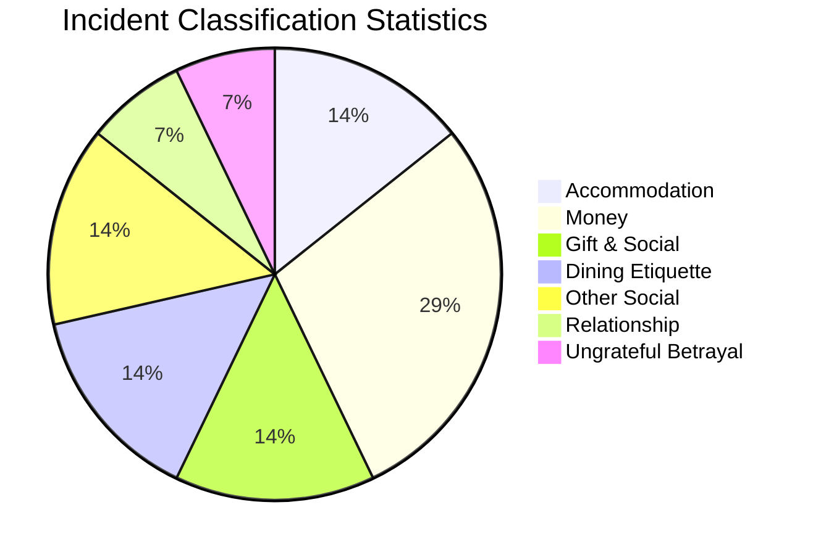
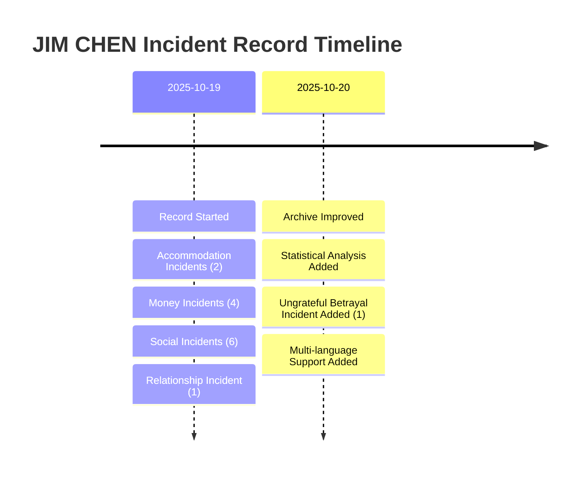

---
tags:
  - Profile
  - Behavioral Record
  - Warning Case
created: 2025-10-19
updated: 2025-10-20
---

# JIM CHEN (陳俊霖)

## 👤 Personal Profile

| Item | Content |
|------|---------|
| **Name** | JIM CHEN (陳俊霖) |
| **Record Start Date** | 2025-10-19 |
| **Main Characteristics** | Freeloading accommodation/food, unpaid debts, lack of basic social etiquette, ungrateful betrayal |
| **Total Incidents** | 14 |
| **Categories** | Accommodation, Money, Gifts, Dining, Social, Relationships, Ungrateful Betrayal |

---

## 🏠 Accommodation Incidents

### Incident 1: Hong Kong Hotel Room Freeloading

**Summary**  
Met with online friend, didn't want to book his own room and freeloaded friend's double bed room. After walking 25,000 steps (**in Hong Kong summer**), went straight to bed with slippers on without showering! Stayed many days, **didn't pay a cent. And he snores**.

**Key Issues**
- ❌ Didn't book room, freeloaded
- ❌ Summer walk 25,000 steps, went to bed without showering
- ❌ Slept with slippers on
- ❌ Stayed many days without paying anything
- ❌ Snoring disturbed others

**Severity Rating**: 🔴🔴🔴🔴🔴 (5/5)

---

### Incident 2: Chungking Mansions Coffin Room

**Summary**  
Met with online friend who had no money, staying in Chungking Mansions (very tiny coffin room). Didn't want to book own room, freeloaded friend's bed. When friend got up to use bathroom, he spread out his arms across the bed. Friend had to stand and watch him all night. **And he snores. (Should pay hundreds to thousands HKD, only gave a dozen useless coins)**

**Key Issues**
- ❌ Knew friend had no money in tiny room but still freeloaded
- ❌ Occupied entire bed, friend had to stand
- ❌ Should pay hundreds to thousands HKD, only gave a dozen useless coins
- ❌ Snoring disturbed others

**Severity Rating**: 🔴🔴🔴🔴🔴 (5/5)

---

## 💰 Money Incidents

### Incident 3: Book Purchase Payment Delay

**Summary**  
Asked Hong Kong friend to help buy books, delayed payment for 3 weeks. Then gave shipping fee after 3 weeks but didn't provide address. To save shipping costs, wanted Hong Kong friend to bring books to Shenzhen, China to mail from there to save **shipping fees**.

**Key Issues**
- ❌ Delayed book payment for 3 weeks
- ❌ Delayed shipping fee for 3 weeks without providing address
- ❌ Asked friend to cross border to save shipping costs

**Severity Rating**: 🔴🔴🔴🔴 (4/5)

---

### Incident 4: Chicken Nuggets AA Payment Delay

**Summary**  
Eating chicken nuggets with online friends. Others ate while chatting, each person only ate one or two pieces. He ate everything and said he was still hungry. Then split bill AA style, and delayed payment for over thirty days.

**Key Issues**
- ❌ Ate all chicken nuggets alone
- ❌ Delayed AA payment for over 30 days

**Severity Rating**: 🔴🔴🔴 (3/5)

---

### Incident 5: Currency Exchange Harassment

**Summary**  
Rarely contacts friends, but every time asks if they can help exchange RMB, HKD, or USDT (he went abroad once, lives in China). Exchanged a bunch of HKD, but when urgently needed money said he had none.

**Key Issues**
- ❌ Only contacts when needing currency exchange
- ❌ Exchanged lots of HKD but claims to have no money

**Severity Rating**: 🔴🔴🔴 (3/5)

---

### Incident 6: Economic Priority Disorder

**Summary**  
Spent 3000 to book driving school for girlfriend who ignored him for three days. Then had no money for college tuition and asked friends to lend money.

**Key Issues**
- ❌ Spent 3000 on girlfriend who ignored him
- ❌ No money for tuition but asked friends to lend

**Severity Rating**: 🔴🔴🔴🔴 (4/5)

---

## 🎁 Gift and Social Incidents

### Incident 7: Demanding Make-up Gift

**Summary**  
Demanded gifts - last time meeting online friend didn't prepare gift for him (he also came empty-handed). Then when sending package asked friend to **"make up"** a gift for him.

**Key Issues**
- ❌ Came empty-handed but demanded gifts
- ❌ Actively requested "make-up" gift

**Severity Rating**: 🔴🔴 (2/5)

---

### Incident 8: Earring Price Tag Incident

**Summary**  
Picking earrings for girlfriend. RMB 19.99, took photo with price tag showing and asked girlfriend if she wants to buy it, or is it too expensive should buy on Taobao?

**Key Issues**
- ❌ Took photo without removing price tag
- ❌ 19.99 still too expensive, wants Taobao

**Severity Rating**: 🔴🔴 (2/5)

---

## 🍽️ Dining Etiquette Incidents

### Incident 9: Food Spillage While Eating

**Summary**  
Spills food while eating.

**Key Issues**
- ❌ Lack of basic dining etiquette

**Severity Rating**: 🔴 (1/5)

---

### Incident 10: KTV BBQ Solo Eating

**Summary**  
Eating BBQ at KTV. Only one portion, grabbed entire thing and ate it all.

**Key Issues**
- ❌ Ate alone in public setting
- ❌ Disregarded others' feelings

**Severity Rating**: 🔴🔴🔴 (3/5)

---

## 📸 Other Social Issues

### Incident 11: Photo Face Blocking

**Summary**  
When taking group photos, completely blocked friend's face.

**Key Issues**
- ❌ Lack of basic photo-taking common sense
- ❌ Didn't consider others' feelings

**Severity Rating**: 🔴🔴 (2/5)

---

### Incident 12: Language Ability Issue

**Summary**  
Daily asks group friends how to improve, how to study abroad. Studied English for three years, went to Hong Kong couldn't recognize **"Toilet"**, had to ask friend to guide him.

**Key Issues**
- ❌ Studied English three years, doesn't recognize "Toilet"
- ❌ Lack of basic life skills

**Severity Rating**: 🔴🔴 (2/5)

---

## 💑 Relationship Incidents

### Incident 13: Issues with Girlfriend

**Summary**  
Wanted to play games with girlfriend, but always didn't want to learn, said it's too troublesome, needs to ask. Always takes very ugly photos of girlfriend. Then posts on IG saying spent 500 on friend and friend calls him godfather. But spent 500 on girlfriend and she ignores him. Also said he can't accept girlfriend's saliva, never kissed girlfriend.

**Key Issues**
- ❌ Too lazy to learn girlfriend's interests
- ❌ Always takes ugly photos of girlfriend
- ❌ Can't accept girlfriend's saliva, never kissed

**Severity Rating**: 🔴🔴🔴🔴 (4/5)

---

## � Ungrateful Betrayal Incident

### Incident 14: Henan Friend Ungrateful Betrayal

**Contributor**: mr.joihead

**Summary**  
Met offline with a very generous person from Henan. The Henan friend treated him extremely well, main acts of kindness included: treating him to Din Tai Fung, occasionally lending 5000 yuan for emergency cash flow. Later had a falling out with the Henan friend, complained about everything, exposed the friend's private matters. The Henan friend angrily called Jim an ungrateful person (白眼狼). Then he twisted the friend's response as "emotional blackmail" and widely publicized it. Although they reconciled later, it caused irreparable damage to the Henan friend's reputation.

**Key Issues**
- ❌ Accepted generous help (treated to Din Tai Fung, borrowed 5000 yuan for cash flow)
- ❌ After falling out, complained and exposed private matters
- ❌ Twisted facts after being called ungrateful
- ❌ Interpreted the friend's legitimate response as "emotional blackmail"
- ❌ Widely publicized and smeared the benefactor
- ❌ Although reconciled, caused irreparable reputation damage

**Impact**
- 💔 Betrayed benefactor's trust
- 📢 Public smear campaign caused reputation damage
- 🔪 Typical case of ungrateful betrayal
- ⚠️ Twisted facts, reversed right and wrong

**Severity Rating**: 🔴🔴🔴🔴🔴 (5/5)

---

## �📊 Behavioral Pattern Summary

### 🚨 Severe Problems

| Problem | Description | Frequency |
|---------|-------------|-----------|
| **Freeloading Addiction** | Multiple times didn't book room, freeloaded friends' accommodation without payment | ⭐⭐⭐⭐⭐ |
| **Unpaid Debts** | Long-term delays on various fees, from tens to thousands | ⭐⭐⭐⭐⭐ |
| **Taking Advantage** | Tries everything to save money, makes others bear costs | ⭐⭐⭐⭐⭐ |
| **Ungrateful Betrayal** | Accepted help then betrayed, smeared benefactor | ⭐⭐⭐⭐⭐ |
| **Snoring Unaware** | Disturbs others' rest without awareness | ⭐⭐⭐⭐ |

### ⚠️ Social Problems

| Problem | Description | Frequency |
|---------|-------------|-----------|
| **Basic Etiquette Lacking** | Not showering, food spillage, solo eating, etc. | ⭐⭐⭐⭐ |
| **Lack of Empathy** | Doesn't consider others' feelings | ⭐⭐⭐⭐⭐ |
| **Exploitative Socialization** | Only contacts when needing help | ⭐⭐⭐⭐ |
| **Economic Priority Chaos** | Doesn't spend on what should, spends on what shouldn't | ⭐⭐⭐⭐ |
| **Twisting Facts** | Interprets others' legitimate responses as attacks | ⭐⭐⭐⭐⭐ |

### 💭 Relationship Attitude Problems

| Problem | Description | Severity |
|---------|-------------|----------|
| **Inconsiderate to Girlfriend** | Ugly photos, perfunctory gifts | ⭐⭐⭐⭐ |
| **More Generous to Friends** | Shows off spending on friends | ⭐⭐⭐ |
| **Intimacy Fear** | Can't accept kissing | ⭐⭐⭐⭐ |

---

## 📈 Statistics

### Incident Timeline

---

## ⚡ Warnings

:::danger 🚨 High Alert
If you know or encounter someone with similar behavioral patterns, strongly recommend:

### Absolutely Don't Do
1. 🚫 **Don't let them freeload accommodation**
   - Won't shower before sleeping
   - Snoring disturbs your rest
   - Won't pay any fees long-term
   - Occupies your private space

2. 🚫 **Don't lend money**
   - Will delay long-term (3 weeks to 30+ days)
   - Various excuses not to return
   - Amounts from tens to thousands
   - Claims no money when urgent

3. 🚫 **Don't help advance any payments**
   - Books, shipping, meals, etc. all delayed
   - Payment delay time indefinite
   - May only give symbolic change

4. 🚫 **Keep distance, avoid exploitation**
   - Only contacts when needing help
   - Exploitative social relationships
   - Lacks basic empathy
:::

---

## 📝 Record Notes

:::info About This Archive
- **Recording Purpose**: Provide real case warnings, prevent more victims
- **Data Source**: All incidents based on real occurrences
- **Update Frequency**: Supplement new incidents anytime
- **Privacy Protection**: Other related personnel's personal information redacted
:::

---

## 🔗 Related Links

- [Return to Notes Home](/en/notes/)
- [View Statistics](#statistics)
- [View Warnings](#warnings)

---

**Last Updated**: 2025-10-20  
**Total Incidents**: 14  
**Recorded by**: Collective records from real victim online friends  

