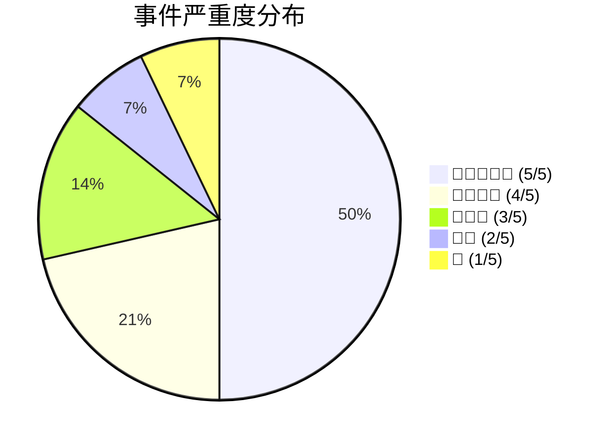
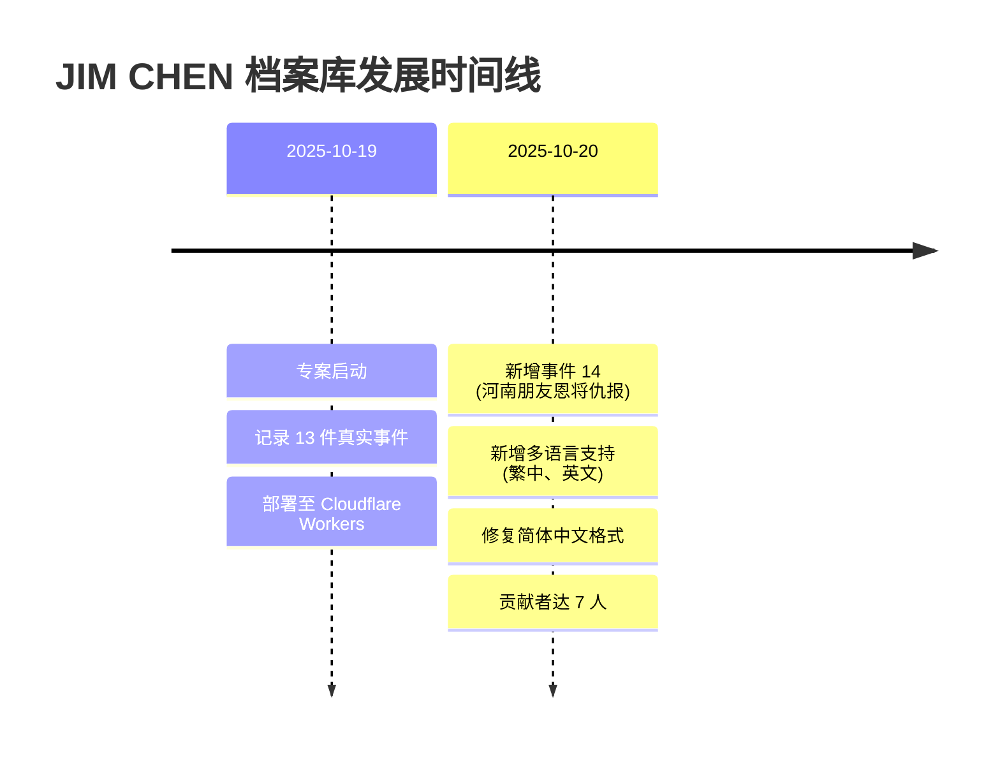

# 📋 最近更新

本页面记录 JIM CHEN 档案库的更新历史。

---

## 2025-10-20

### 🌐 多语言与内容更新
- ✅ 新增繁体中文 (zh-TW) 与英文 (en) 版本
- ✅ 完整翻译首页、笔记索引、更新记录与主文档
- ✅ 重新整理简体中文版，统一使用简体字与语系连结
- ✅ 新增 mr.joihead 投稿的 **事件 14：河南朋友恩将仇报事件**

### 🧾 事件与统计调整
- 🔄 事件总数更新为 **14 件**
- ➕ 新增事件分类：🔪 恩将仇报事件 (1 件)
- 📈 更新行为模式总结，加入「恩将仇报」、「扭曲事实」
- 📝 更新统计图表与时间线，标注新事件
- 🙏 新增贡献者 **mr.joihead** (事件 14 投稿人)

### 🔧 系统修复
- 🔁 修复简体中文文档的标点与连结格式
- 🧭 补齐所有语言版本的导览与站内连结
- 🧹 持续清理 Nólëbase 遗留内容

---

## 2025-10-19

### 🎉 专案启动
- ✅ 建立 JIM CHEN 档案库
- ✅ 完整记录 13 件真实事件
- ✅ 建立行为模式分析、统计图表与时间线
- ✅ 部署至 Cloudflare Workers

### 📊 事件统计 (首日资料)
| 类别 | 数量 | 严重度分布 |
|------|------|------------|
| 🏠 住宿相关 | 2 | 🔴🔴🔴🔴🔴 (5/5) ×2 |
| 💰 金钱相关 | 4 | 🔴🔴🔴🔴 (4/5) ×2, 🔴🔴🔴 (3/5) ×2 |
| 🎁 礼物社交 | 2 | 🔴🔴 (2/5) ×2 |
| 🍽️ 用餐礼仪 | 2 | 🔴🔴🔴 (3/5) ×1, 🔴 (1/5) ×1 |
| 📸 其他社交 | 2 | 🔴🔴 (2/5) ×2 |
| 💔 感情相关 | 1 | 🔴🔴🔴🔴 (4/5) ×1 |
| **总计** | **13** | 平均严重度: 3.2/5 |

### 👥 贡献者 (依加入时间)
- **Zakk (Zakkaus)** - 维护者
- **Hamfurry (sgt.hamburger)** - 事件提供者
- **啾头 (lan._.o)** - 事件提供者
- **李陶 (alubinnananas)** - 事件提供者
- **戴维 (david_2806)** - 事件提供者
- **Yuz (yuz_vividayz)** - 事件提供者
- **mr.joihead** - 事件 14 投稿人

---

## 📈 统计数据

### 事件时间线

---

## 🔗 快速导航

- [返回首页](/zh-TW/)
- [查看完整档案](/zh-TW/笔记/📦%20收集箱/陈俊霖%20JIM%20CHEN)
- [笔记分类](/zh-TW/笔记/)

---

**档案库统计**  
📅 运行天数: 2 天 | 📝 事件总数: 14 件 | 👥 贡献者: 7 人

