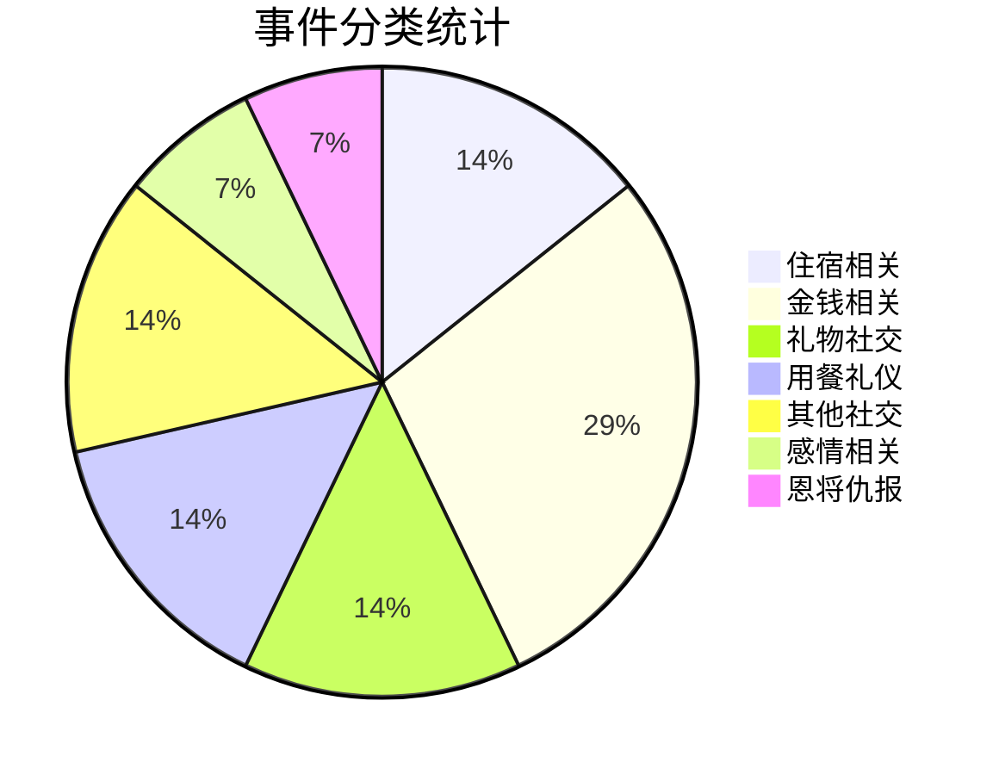
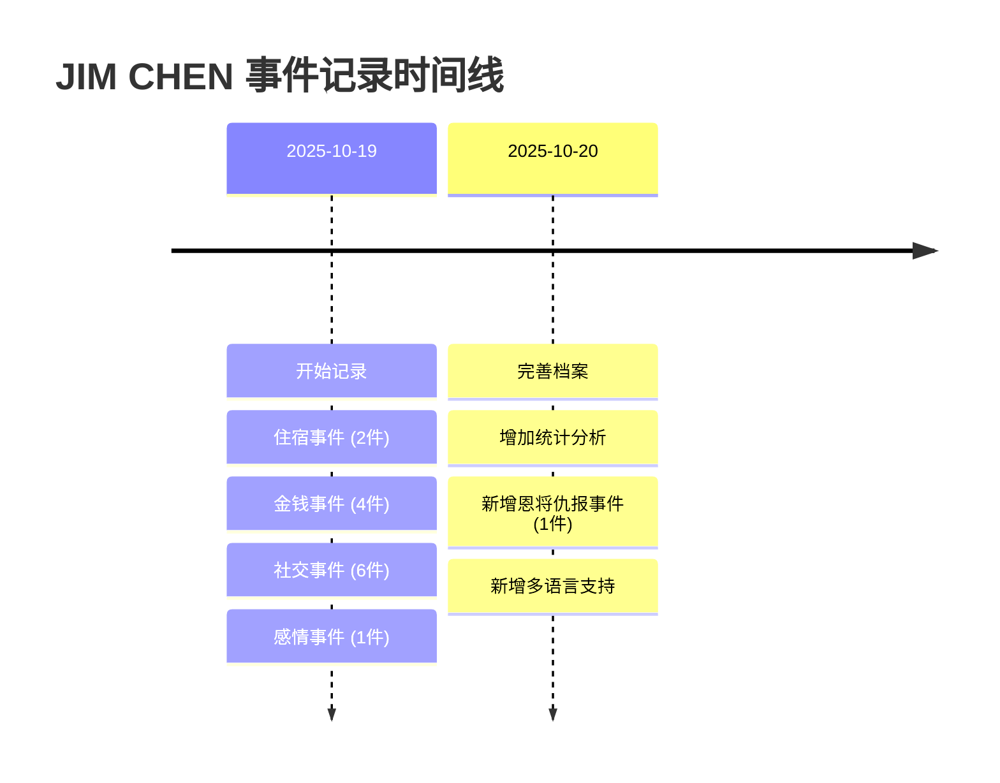

---
tags:
  - 人物档案
  - 行为记录
  - 警示案例
created: 2025-10-19
updated: 2025-10-20
---

# 陈俊霖 JIM CHEN

## 👤 个人档案

| 项目 | 内容 |
|------|------|
| **姓名** | 陈俊霖(JIM CHEN) |
| **记录开始时间** | 2025-10-19 |
| **主要特征** | 蹭吃蹭住、欠钱不还、缺乏基本社交礼仪、恩将仇报 |
| **事件总数** | 14 件 |
| **涉及类别** | 住宿、金钱、礼物、用餐、社交、感情、恩将仇报 |

---

## 🏠 住宿相关事件

### 事件 1:香港大床房蹭住事件

**事件概要**  
和网友见面,自己不想订房间蹭网友的大床房。然后走了 25000 步(**香港的夏天**)倒头就睡穿著拖鞋没有洗澡!很多天,**一分钱没给。而且他打鼾**。

**关键问题**
- ❌ 不订房间蹭住
- ❌ 夏天走了 25000 步不洗澡直接睡
- ❌ 穿著拖鞋睡觉
- ❌ 住了很多天一分钱不给
- ❌ 打鼾影响他人

**严重性评级**: 🔴🔴🔴🔴🔴 (5/5)

---

### 事件 2:重庆大厦棺材房事件

**事件概要**  
和网友见面,网友没钱,住的重庆大厦(很小很小的棺材房)。自己不想订房间蹭网友的床,然后网友起来上厕所,他直接把手摊开,网友站著看了他一晚上。**而且他打鼾。(几百港币到几千,只给十几块钱 - 没用的硬币)**

**关键问题**
- ❌ 明知网友没钱住小房间还要蹭
- ❌ 占据整张床,网友只能站著
- ❌ 应付几百到几千港币,只给十几块没用的硬币
- ❌ 打鼾影响他人

**严重性评级**: 🔴🔴🔴🔴🔴 (5/5)

---

## 💰 金钱相关事件

### 事件 3:买书拖欠款项事件

**事件概要**  
叫香港朋友,给他帮忙买书,拖了 3 周才给钱,然后给快递费给了 3 周还不给地址,然后为了省快递费想让香港的朋友给他带到中国深圳去寄快递省**快递费**。

**关键问题**
- ❌ 拖欠书款 3 周
- ❌ 拖欠快递费 3 周且不给地址
- ❌ 要求朋友跨境带书以省快递费

**严重性评级**: 🔴🔴🔴🔴 (4/5)

---

### 事件 4:鸡块 AA 拖欠事件

**事件概要**  
在和网友吃鸡块,别人一边吃一边聊天,每个人只吃了一两块,他吃完了还说饿,然后还我们 AA,并且拖了三十余天 AA 钱。

**关键问题**
- ❌ 一个人吃完所有鸡块
- ❌ 拖欠 AA 款项超过 30 天

**严重性评级**: 🔴🔴🔴 (3/5)

---

### 事件 5:换汇骚扰事件

**事件概要**  
不常联系,但是每次找网友都是问网友可不可以帮他换人民币、换港币、换 USDT(他出过一次国,就住在中国)换了一堆港币,急用钱的时候又说没钱。

**关键问题**
- ❌ 只在需要换汇时才联系
- ❌ 换了一堆港币却说没钱

**严重性评级**: 🔴🔴🔴 (3/5)

---

### 事件 6:经济优先级错乱事件

**事件概要**  
花了 3000 给三天不理他的女朋友定驾校,然后他没钱付大专学费问网友能不能借钱。

**关键问题**
- ❌ 给不理他的女朋友花 3000
- ❌ 没钱交学费却找网友借钱

**严重性评级**: 🔴🔴🔴🔴 (4/5)

---

## 🎁 礼物与社交事件

### 事件 7:索要补礼物事件

**事件概要**  
要礼物 - 上次和网友见面的礼物没给他准备(他也空手来)然后过寄快递的时候让朋友**"补"**礼物给他。

**关键问题**
- ❌ 自己空手来却要求礼物
- ❌ 主动要求"补"礼物

**严重性评级**: 🔴🔴 (2/5)

---

### 事件 8:耳环价格标签事件

**事件概要**  
给女朋友挑耳环。人民币 19.99 拍照带著价格标签问女朋友要不要买,还是太贵了去淘宝买?

**关键问题**
- ❌ 拍照不撕价格标签
- ❌ 19.99 还嫌贵要去淘宝买

**严重性评级**: 🔴🔴 (2/5)

---

## 🍽️ 用餐礼仪事件

### 事件 9:用餐漏饭

**事件概要**  
吃饭漏饭。

**关键问题**
- ❌ 基本用餐礼仪缺失

**严重性评级**: 🔴 (1/5)

---

### 事件 10:KTV 烧烤独食事件

**事件概要**  
KTV 吃烧烤。只有一份整个拿起来吃完。

**关键问题**
- ❌ 公共场合独食
- ❌ 不顾他人感受

**严重性评级**: 🔴🔴🔴 (3/5)

---

## 📸 其他社交问题

### 事件 11:拍照挡脸事件

**事件概要**  
拍合照的时候把网友的脸全部挡住。

**关键问题**
- ❌ 缺乏拍照基本常识
- ❌ 不考虑他人感受

**严重性评级**: 🔴🔴 (2/5)

---

### 事件 12:语言能力问题

**事件概要**  
天天询问群友,怎么变好,怎么留学,学了三年英语去香港认不清 **"Toilet"** 叫朋友带他。

**关键问题**
- ❌ 学了三年英语连 Toilet 都不认识
- ❌ 基本生活能力缺失

**严重性评级**: 🔴🔴 (2/5)

---

## 💑 感情相关事件

### 事件 13:与女朋友相处问题

**事件概要**  
想要和女朋友一起玩游戏,但是总是不想学,他说太麻烦了,又要问。一直给她女朋友拍的特别难看。然后发 IG 说给兄弟花 500 块钱兄弟会喊他义父。然后给女朋友花 500 女朋友不理他,还说他没办法接受女朋友的口水,没和女朋友接吻过。

**关键问题**
- ❌ 懒得学习女朋友的兴趣
- ❌ 总是把女朋友拍得很难看
- ❌ 不接受女朋友的口水,没接吻过

**严重性评级**: 🔴🔴🔴🔴 (4/5)

---

## 🔪 恩将仇报事件

### 事件 14:河南朋友恩将仇报事件

**投稿人**: mr.joihead

**事件概要**  
线下与一个非常慷慨的河南人见面。河南朋友对他非常好,主要善行包括:请客吃鼎泰丰、偶尔借钱帮助周转 5000 元。后来与河南人闹翻,各种埋怨,把河南人的老底揭穿。河南人一气之下说 jim 是白眼狼,然后他把对方的行为解读成情绪勒索,并大肆宣扬。虽然后面和解了,但对河南人造成了不可磨灭的名誉伤害。

**关键问题**
- ❌ 接受他人慷慨帮助(请客吃鼎泰丰、借钱5000元周转)
- ❌ 闹翻后各种埋怨、揭老底
- ❌ 被指责白眼狼后扭曲事实
- ❌ 将对方正当反应解读为"情绪勒索"
- ❌ 大肆宣扬抹黑恩人
- ❌ 虽和解但已造成不可磨灭的名誉伤害

**事件影响**
- 💔 背叛恩人的信任
- 📢 公开抹黑造成名誉伤害
- 🔪 恩将仇报的典型案例
- ⚠️ 扭曲事实、颠倒黑白

**严重性评级**: 🔴🔴🔴🔴🔴 (5/5)

---

## 📊 行为模式总结

### 🚨 严重问题

| 问题 | 描述 | 频率 |
|------|------|------|
| **蹭吃蹭住成瘾** | 多次不订房间蹭网友住宿,且不支付费用 | ⭐⭐⭐⭐⭐ |
| **欠钱不还** | 长期拖欠各种费用,从几十到几千不等 | ⭐⭐⭐⭐⭐ |
| **占小便宜** | 想尽办法省钱,却让别人承担成本 | ⭐⭐⭐⭐⭐ |
| **恩将仇报** | 接受帮助后翻脸、抹黑恩人 | ⭐⭐⭐⭐⭐ |
| **打鼾且不自知** | 影响他人休息却毫无意识 | ⭐⭐⭐⭐ |

### ⚠️ 社交问题

| 问题 | 描述 | 频率 |
|------|------|------|
| **基本礼仪缺失** | 不洗澡、漏饭、独食等 | ⭐⭐⭐⭐ |
| **缺乏同理心** | 不考虑他人感受 | ⭐⭐⭐⭐⭐ |
| **利用型社交** | 只在需要帮助时联系 | ⭐⭐⭐⭐ |
| **经济优先级混乱** | 该花的不花,不该花的乱花 | ⭐⭐⭐⭐ |
| **扭曲事实** | 将他人正当反应解读为攻击 | ⭐⭐⭐⭐⭐ |

### 💭 感情观念问题

| 问题 | 描述 | 严重性 |
|------|------|--------|
| **对女朋友不用心** | 拍照难看、送礼敷衍 | ⭐⭐⭐⭐ |
| **对朋友更大方** | 给朋友花钱就炫耀 | ⭐⭐⭐ |
| **亲密关系恐惧** | 不能接受接吻 | ⭐⭐⭐⭐ |

---

## 📈 统计数据

### 事件时间线

---

## ⚡ 警示提醒

:::danger 🚨 高度警戒
如果你认识或遇到类似行为模式的人,强烈建议:

### 绝对不要做的事
1. 🚫 **不要让其蹭住**
   - 会不洗澡直接睡
   - 打鼾影响你休息
   - 长期不付任何费用
   - 占用你的私人空间

2. 🚫 **不要借钱**
   - 会长期拖欠(3周到30天+)
   - 找各种理由不还
   - 金额从几十到几千不等
   - 急用钱时又说没钱

3. 🚫 **不要帮忙垫付任何费用**
   - 买书、快递、餐费等全会拖
   - 拖款时间不定
   - 可能只给象征性的零钱

4. 🚫 **保持距离,避免被利用**
   - 只在需要帮助时才联系
   - 利用型社交关系
   - 缺乏基本的同理心
:::

---

## 📝 记录说明

:::info 关于本档案
- **记录目的**: 提供真实案例警示,避免更多人受害
- **资料来源**: 所有事件均基于真实发生的情况
- **更新频率**: 随时补充新事件
- **隐私保护**: 已隐去其他相关人员的个人信息
:::

---

## 🔗 相关连结

- [返回笔记首页](/zh-CN/笔记/)
- [查看事件统计](#统计数据)
- [查看警示提醒](#警示提醒)

---

**最后更新**: 2025-10-20  
**事件总数**: 14 件  
**记录者**: 真实受害网友集体记录  

