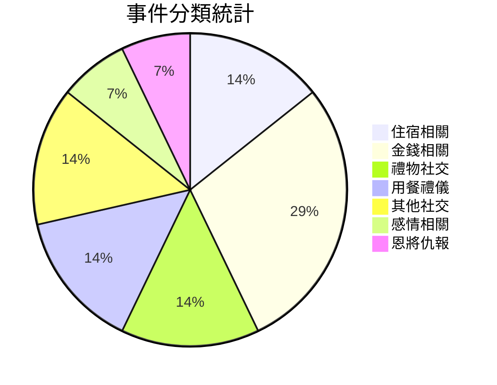
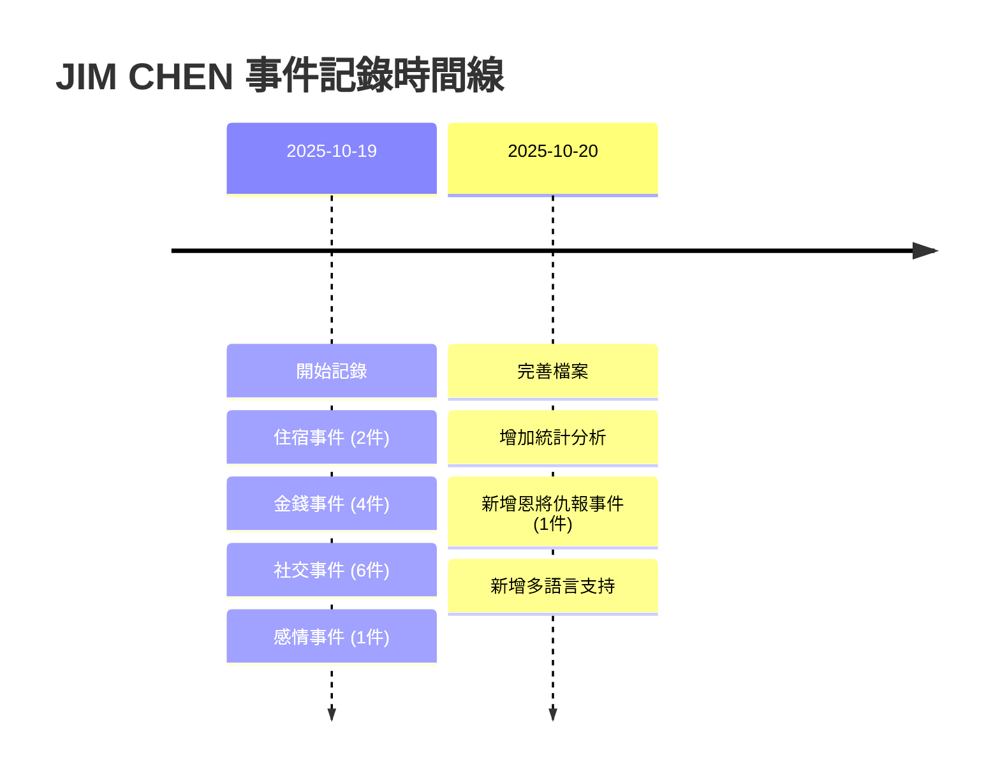

---
tags:
  - 人物檔案
  - 行為記錄
  - 警示案例
created: 2025-10-19
updated: 2025-10-20
---

# 陳俊霖 JIM CHEN

## 👤 個人檔案

| 項目 | 內容 |
|------|------|
| **姓名** | 陳俊霖(JIM CHEN) |
| **記錄開始時間** | 2025-10-19 |
| **主要特徵** | 蹭吃蹭住、欠錢不還、缺乏基本社交禮儀、恩將仇報 |
| **事件總數** | 14 件 |
| **涉及類別** | 住宿、金錢、禮物、用餐、社交、感情、恩將仇報 |

---

## 🏠 住宿相關事件

### 事件 1:香港大床房蹭住事件

**事件概要**  
和網友見面,自己不想訂房間蹭網友的大床房。然後走了 25000 步(**香港的夏天**)倒頭就睡穿著拖鞋沒有洗澡!很多天,**一分錢沒給。而且他打鼾**。

**關鍵問題**
- ❌ 不訂房間蹭住
- ❌ 夏天走了 25000 步不洗澡直接睡
- ❌ 穿著拖鞋睡覺
- ❌ 住了很多天一分錢不給
- ❌ 打鼾影響他人

**嚴重性評級**: 🔴🔴🔴🔴🔴 (5/5)

---

### 事件 2:重慶大廈棺材房事件

**事件概要**  
和網友見面,網友沒錢,住的重慶大廈(很小很小的棺材房)。自己不想訂房間蹭網友的床,然後網友起來上廁所,他直接把手攤開,網友站著看了他一晚上。**而且他打鼾。(幾百港幣到幾千,只給十幾塊錢 - 沒用的硬幣)**

**關鍵問題**
- ❌ 明知網友沒錢住小房間還要蹭
- ❌ 佔據整張床,網友只能站著
- ❌ 應付幾百到幾千港幣,只給十幾塊沒用的硬幣
- ❌ 打鼾影響他人

**嚴重性評級**: 🔴🔴🔴🔴🔴 (5/5)

---

## 💰 金錢相關事件

### 事件 3:買書拖欠款項事件

**事件概要**  
叫香港朋友,給他幫忙買書,拖了 3 週才給錢,然後給快遞費給了 3 週還不給地址,然後為了省快遞費想讓香港的朋友給他帶到中國深圳去寄快遞省**快遞費**。

**關鍵問題**
- ❌ 拖欠書款 3 週
- ❌ 拖欠快遞費 3 週且不給地址
- ❌ 要求朋友跨境帶書以省快遞費

**嚴重性評級**: 🔴🔴🔴🔴 (4/5)

---

### 事件 4:雞塊 AA 拖欠事件

**事件概要**  
在和網友吃雞塊,別人一邊吃一邊聊天,每個人只吃了一兩塊,他吃完了還說餓,然後還我們 AA,並且拖了三十餘天 AA 錢。

**關鍵問題**
- ❌ 一個人吃完所有雞塊
- ❌ 拖欠 AA 款項超過 30 天

**嚴重性評級**: 🔴🔴🔴 (3/5)

---

### 事件 5:換匯騷擾事件

**事件概要**  
不常聯繫,但是每次找網友都是問網友可不可以幫他換人民幣、換港幣、換 USDT(他出過一次國,就住在中國)換了一堆港幣,急用錢的時候又說沒錢。

**關鍵問題**
- ❌ 只在需要換匯時才聯繫
- ❌ 換了一堆港幣卻說沒錢

**嚴重性評級**: 🔴🔴🔴 (3/5)

---

### 事件 6:經濟優先級錯亂事件

**事件概要**  
花了 3000 給三天不理他的女朋友定駕校,然後他沒錢付大專學費問網友能不能借錢。

**關鍵問題**
- ❌ 給不理他的女朋友花 3000
- ❌ 沒錢交學費卻找網友借錢

**嚴重性評級**: 🔴🔴🔴🔴 (4/5)

---

## 🎁 禮物與社交事件

### 事件 7:索要補禮物事件

**事件概要**  
要禮物 - 上次和網友見面的禮物沒給他準備(他也空手來)然後過寄快遞的時候讓朋友**"補"**禮物給他。

**關鍵問題**
- ❌ 自己空手來卻要求禮物
- ❌ 主動要求"補"禮物

**嚴重性評級**: 🔴🔴 (2/5)

---

### 事件 8:耳環價格標籤事件

**事件概要**  
給女朋友挑耳環。人民幣 19.99 拍照帶著價格標籤問女朋友要不要買,還是太貴了去淘寶買?

**關鍵問題**
- ❌ 拍照不撕價格標籤
- ❌ 19.99 還嫌貴要去淘寶買

**嚴重性評級**: 🔴🔴 (2/5)

---

## 🍽️ 用餐禮儀事件

### 事件 9:用餐漏飯

**事件概要**  
吃飯漏飯。

**關鍵問題**
- ❌ 基本用餐禮儀缺失

**嚴重性評級**: 🔴 (1/5)

---

### 事件 10:KTV 燒烤獨食事件

**事件概要**  
KTV 吃燒烤。只有一份整個拿起來吃完。

**關鍵問題**
- ❌ 公共場合獨食
- ❌ 不顧他人感受

**嚴重性評級**: 🔴🔴🔴 (3/5)

---

## 📸 其他社交問題

### 事件 11:拍照擋臉事件

**事件概要**  
拍合照的時候把網友的臉全部擋住。

**關鍵問題**
- ❌ 缺乏拍照基本常識
- ❌ 不考慮他人感受

**嚴重性評級**: 🔴🔴 (2/5)

---

### 事件 12:語言能力問題

**事件概要**  
天天詢問群友,怎麼變好,怎麼留學,學了三年英語去香港認不清 **"Toilet"** 叫朋友帶他。

**關鍵問題**
- ❌ 學了三年英語連 Toilet 都不認識
- ❌ 基本生活能力缺失

**嚴重性評級**: 🔴🔴 (2/5)

---

## 💑 感情相關事件

### 事件 13:與女朋友相處問題

**事件概要**  
想要和女朋友一起玩遊戲,但是總是不想學,他說太麻煩了,又要問。一直給她女朋友拍的特別難看。然後發 IG 說給兄弟花 500 塊錢兄弟會喊他義父。然後給女朋友花 500 女朋友不理他,還說他沒辦法接受女朋友的口水,沒和女朋友接吻過。

**關鍵問題**
- ❌ 懶得學習女朋友的興趣
- ❌ 總是把女朋友拍得很難看
- ❌ 不接受女朋友的口水,沒接吻過

**嚴重性評級**: 🔴🔴🔴🔴 (4/5)

---

## � 恩將仇報事件

### 事件 14:河南朋友恩將仇報事件

**投稿人**: mr.joihead

**事件概要**  
線下與一個非常慷慨的河南人見面。河南朋友對他非常好,主要善行包括:請客吃鼎泰豐、偶爾借錢幫助周轉 5000 元。後來與河南人鬧翻,各種埋怨,把河南人的老底揭穿。河南人一氣之下說 jim 是白眼狼,然後他把對方的行為解讀成情緒勒索,並大肆宣揚。雖然後面和解了,但對河南人造成了不可磨滅的名譽傷害。

**關鍵問題**
- ❌ 接受他人慷慨幫助(請客吃鼎泰豐、借錢5000元周轉)
- ❌ 鬧翻後各種埋怨、揭老底
- ❌ 被指責白眼狼後扭曲事實
- ❌ 將對方正當反應解讀為"情緒勒索"
- ❌ 大肆宣揚抹黑恩人
- ❌ 雖和解但已造成不可磨滅的名譽傷害

**事件影響**
- 💔 背叛恩人的信任
- 📢 公開抹黑造成名譽傷害
- 🔪 恩將仇報的典型案例
- ⚠️ 扭曲事實、顛倒黑白

**嚴重性評級**: 🔴🔴🔴🔴🔴 (5/5)

---

## �📊 行為模式總結

### 🚨 嚴重問題

| 問題 | 描述 | 頻率 |
|------|------|------|
| **蹭吃蹭住成癮** | 多次不訂房間蹭網友住宿,且不支付費用 | ⭐⭐⭐⭐⭐ |
| **欠錢不還** | 長期拖欠各種費用,從幾十到幾千不等 | ⭐⭐⭐⭐⭐ |
| **占小便宜** | 想盡辦法省錢,卻讓別人承擔成本 | ⭐⭐⭐⭐⭐ |
| **恩將仇報** | 接受幫助後翻臉、抹黑恩人 | ⭐⭐⭐⭐⭐ |
| **打鼾且不自知** | 影響他人休息卻毫無意識 | ⭐⭐⭐⭐ |

### ⚠️ 社交問題

| 問題 | 描述 | 頻率 |
|------|------|------|
| **基本禮儀缺失** | 不洗澡、漏飯、獨食等 | ⭐⭐⭐⭐ |
| **缺乏同理心** | 不考慮他人感受 | ⭐⭐⭐⭐⭐ |
| **利用型社交** | 只在需要幫助時聯繫 | ⭐⭐⭐⭐ |
| **經濟優先級混亂** | 該花的不花,不該花的亂花 | ⭐⭐⭐⭐ |
| **扭曲事實** | 將他人正當反應解讀為攻擊 | ⭐⭐⭐⭐⭐ |

### 💭 感情觀念問題

| 問題 | 描述 | 嚴重性 |
|------|------|--------|
| **對女朋友不用心** | 拍照難看、送禮敷衍 | ⭐⭐⭐⭐ |
| **對朋友更大方** | 給朋友花錢就炫耀 | ⭐⭐⭐ |
| **親密關係恐懼** | 不能接受接吻 | ⭐⭐⭐⭐ |

---

## 📈 統計數據

### 事件時間線

---

## ⚡ 警示提醒

:::danger 🚨 高度警戒
如果你認識或遇到類似行為模式的人,強烈建議:

### 絕對不要做的事
1. 🚫 **不要讓其蹭住**
   - 會不洗澡直接睡
   - 打鼾影響你休息
   - 長期不付任何費用
   - 佔用你的私人空間

2. 🚫 **不要借錢**
   - 會長期拖欠(3週到30天+)
   - 找各種理由不還
   - 金額從幾十到幾千不等
   - 急用錢時又說沒錢

3. 🚫 **不要幫忙墊付任何費用**
   - 買書、快遞、餐費等全會拖
   - 拖款時間不定
   - 可能只給象徵性的零錢

4. 🚫 **保持距離,避免被利用**
   - 只在需要幫助時才聯繫
   - 利用型社交關係
   - 缺乏基本的同理心
:::

---

## 📝 記錄說明

:::info 關於本檔案
- **記錄目的**: 提供真實案例警示,避免更多人受害
- **資料來源**: 所有事件均基於真實發生的情況
- **更新頻率**: 隨時補充新事件
- **隱私保護**: 已隱去其他相關人員的個人信息
:::

---

## 🔗 相關連結

- [返回筆記首頁](/zh-TW/筆記/)
- [查看事件統計](#統計數據)
- [查看警示提醒](#警示提醒)

---

**最後更新**: 2025-10-20  
**事件總數**: 14 件  
**記錄者**: 真實受害網友集體記錄  

